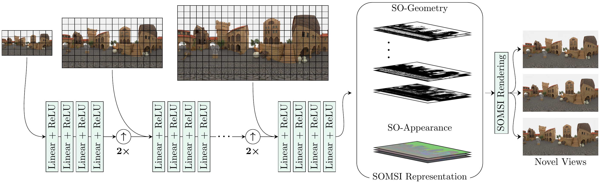

<h2 align=center> SOMSI: Spherical Novel View Synthesis with Soft Occlusion Multi-Sphere Images </h2>
<div align=center>
<span> <a href="https://tedyhabtegebrial.github.io/">Tewodros Habtegebrial</a></span> ,
<span> <a href="https://av.dfki.de/members/gava/">Christiano Gava</a></span> ,
<span> <a href="https://av.dfki.de/members/rogge/">Marcel Rogge</a></span> ,
<span> <a href="https://av.dfki.de/members/stricker/">Didier Stricker</a></span>,
<span> <a href="https://varunjampani.github.io/">Varun Jampani</a></span>
<br>  IEEE/CVF Computer Vision and Pattern Recognition Conference (CVPR) 2022  <br> The project page can be found <a href="https://tedyhabtegebrial.github.io/somsi/">here</a>
</div>

<!-- <div align=center width=750px class="row"> -->

<div class="column">
    
  </div>
</div>


## Dependencies
This code was develped with ```python3.6```
```
pytorch_lightning==1.2.4
torch==1.7.1
numpy==1.18.5
opencv-python==4.5.1
kornia==0.4.1
lpips==0.1.3
```

## Datasets
Download [link](https://drive.google.com/drive/folders/1baI9zZCOJyjI278LCylnHWNF41KI-JkF).
Save the dataset to the folder ```somsi_data```
Please check the [datasets](/docs/data/dataset.md) page for more details on each dataset.

## Training your own models
Please check the following script as an example.
```
./scripts/med_port.sh
```

## Testing our pre-trained models
Download models from this [link](https://drive.google.com/drive/folders/1h7aNxtV-VT6hX_d-HW2njGRZCSDHPooW?usp=sharing). Extract the downloads to ```ckpts`` directory under the project directory.

Take a look at a sample test script. Before running, check the note on ERP resolution and appearance feature size, below.

```
./scripts/med_port_test.sh
```

The following parameters are crucial to avoid errors.
### ERP Resolution
We have trained models with MatryODSHka resolutoin $320 \times 640$ and $768 \times 1536$. Make sure the ckpt you are using and the height and width parameters match.
Ckpt folders end with $height \times width$.

### Appearance Feature Dimensionality
We provide models with the following features sizes ```3, 12, 24```

If the model ckpt base file name contains feat_x $x \in [3, 12, 24]$, pass

```
--feats_per_layer=x # x in [3,12,24]
```

### Scene Number
```Replica``` and ```Residential Area``` datasets have, 14 and 3 scenes, respectively. During training and testing pass the corect ``scene_number`` parameter. ```scene_number``` ranges from ```0-13`` for Replica and ```0-2``` for Residential Area datasets.


### Missing Features

- [x] Test Code
- [ ] Demo Code
- [ ] Datasets
  - [x] Residential
  - [x] Replica
  - [ ] Coffee Area
- [ ] Reflectance Modelling
- [ ] S-NeRF Baseline


Acknowledgments: This repo builds upon the [Nerf-PL](https://github.com/kwea123/nerf_pl).
