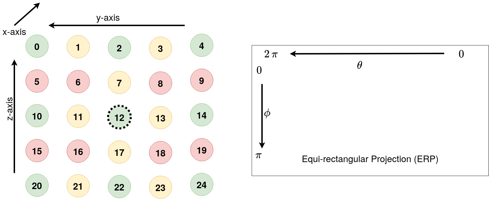

<h1 align=left> Datasets </h1>
<h2 align=left> Medieval Port Dataset </h2>
<h3 align=left> Camera Arrangement </h3>
This dataset consists of a light-field with 25 sub-aperture images, arranged as shown below. The color coding indicates the training/test/val split.

- Cameras are color coded as follows
  - *Training*, *Validation*, *Test*
- The *baseline* between cameras is **0.2 units**.
- Reference camera (12) is shown in dotted circle.
- The azimuth angle theta goes from right to left.
- Elevation angle phi goes from top to bottom.

    
  

